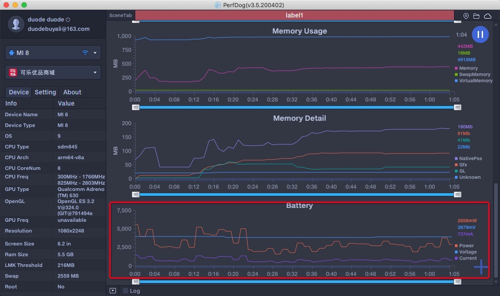
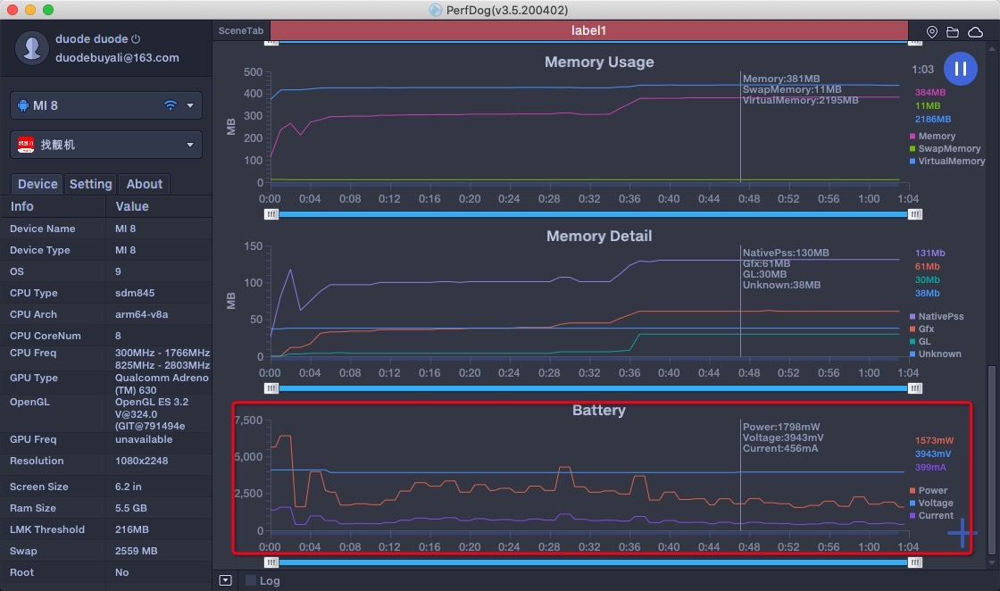

# 功耗分析

用户一般情况下，不会去在意APP的功耗情况，但是作为开发者我们应该尽量避免不必要的功耗。

## 可乐功耗数据
这里我们使用`PrefDog`记录`可乐优品`在首页使用一分钟的功耗数据:

## 找靓机功耗数据
这里我们使用`PrefDog`记录`找靓机`在首页使用一分钟的功耗数据:

## 数据分析

经过对比可以发现，`可乐优品`功耗更高，且波起伏较多。说明可乐优品启动时在后台做了更多的任务，可以考虑减少网络请求和定位请求。
