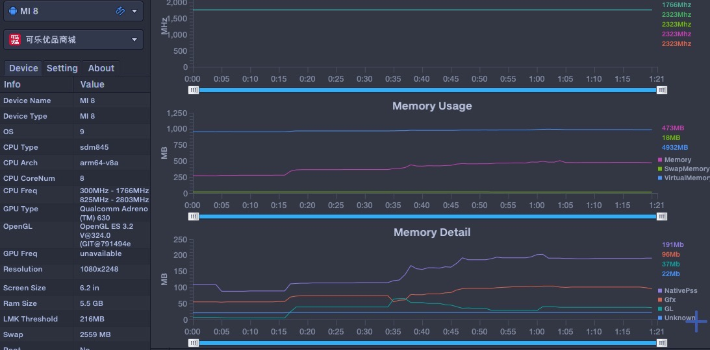

# 可乐优品内存使用情况数据分析

程序内存的管理是否合理高效对应用的性能有着很大的影响。推荐阅读Android性能优化典范-第3季，参考[这里](http://hukai.me/android-performance-patterns-season-3/)。

这里我们使用`PrefDog`监听`可乐优品`首页各个tab切换时的内存使用情况:

## 内存浪费

`内存浪费`体现在开发过程中的各个方面,这里举一些常用的场景：
* 频繁创建对象实例后又马上回收，导致内存抖动(如：onDraw方法中创建对象)
* 使用更大的数据结构(如：在能使用`SpareArray`代替`HashMap`的情况，仍然使用`HashMap`)
* 使用`Bitmap `时，未进行回收或压缩
* 字符串拼接时，使用`String`，而不是`StringBuilder`
* 使用线程时，没有及时终止等

### 内存数据分析
我们发现如上图展示的数据，比较正常。这说明首页各个tab基本没有大问题，

## 内存泄漏

特殊情况下会出现对象无法回收(java对象回收逻辑，参考[这里](https://www.cnblogs.com/zhaoqi3215/p/5243766.html))的情况，这时就会导致`内存泄漏`。

所以我们需要尽量采取如下方法避免`内存泄漏`:
- 尽量不要让静态变量引用Activity
- 使用WeakReference弱引用，会保证GC时会被回收
- 使用静态内部类来代替内部类，静态内部类不持有外部类的引用
- 静态内部类使用弱引用来引用外部类
- 在声明周期结束的时候释放资源

### 内存数据分析
我们发现如上图展示的数据，比较正常。这说明首页各个tab基本没有大问题，
