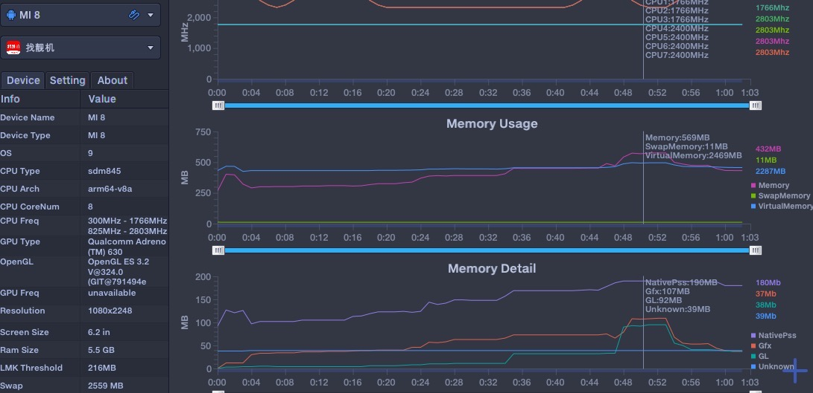

# 找靓机内存使用情况数据分析

程序内存的管理是否合理高效对应用的性能有着很大的影响。推荐阅读Android性能优化典范-第3季，参考[这里](http://hukai.me/android-performance-patterns-season-3/)。

这里我们使用`PrefDog`监听`找靓机`首页各个tab切换时的内存使用情况:

## 数据分析
从这段数据，可以看出`找靓机`的内存使用比`可乐优品`要小，但是在打开活动H5时，会出现一个峰值。

