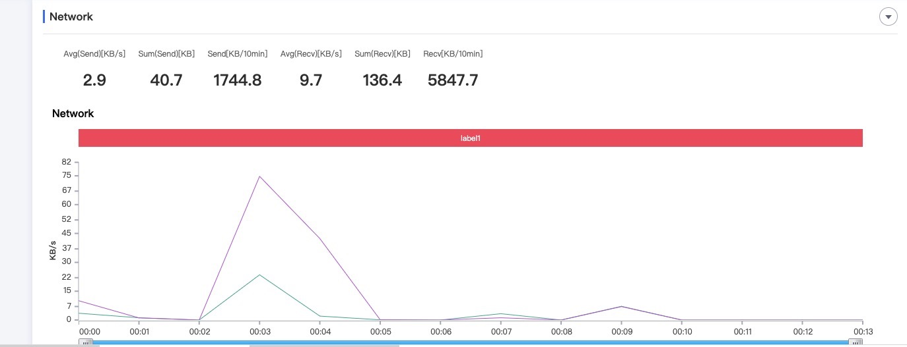
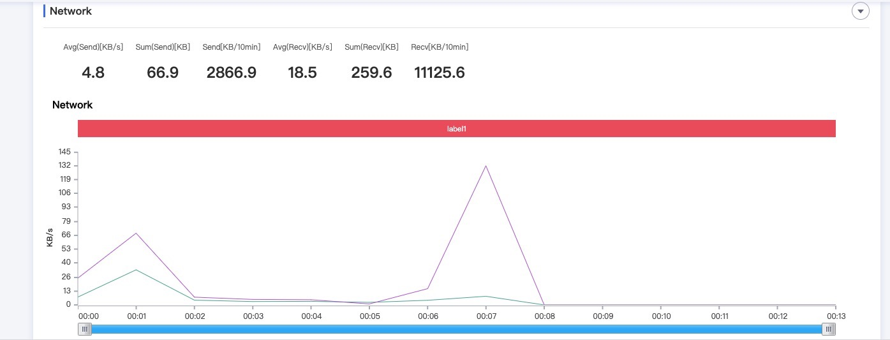

# 流量使用分析

现在是互联网的时代，各个公司都希望自己的APP对用户吸引力更大。在类似功能的APP对比时，在功能相差不大的情况下，势必考虑到经济因素(由于国内APP都是免费，只考虑APP使用代价)，这里就不得不考虑到数据流量问题了。

## 可乐优品主页流量数据
这里我们监听`可乐优品`首页启动时的流量使用情况:

## 找靓机主页流量数据
这里我们监听`找靓机`首页启动时的流量使用情况:

