# 可乐优品UI渲染数据

这里针对可乐优品的首页分析其中的`过度渲染`和`布局冗杂`问题。

## 过度渲染

首先我们开启Android系统自带的`GPU过度绘制`开关。

> 设置 — 开发中选项 — 调试GPU过度绘制

这时我们打开，`可乐优品APP`等待主页加载完成，可以获取到当前页面的绘制情况。

* 首页第一部分UI过度绘制情况
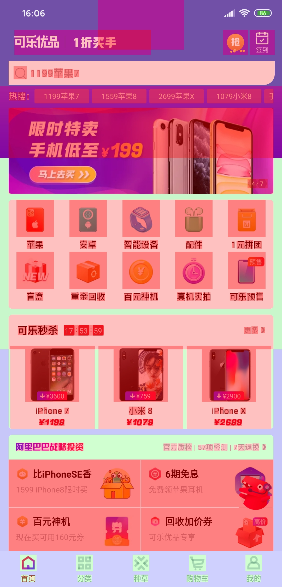

* 首页第二部分UI过度绘制情况
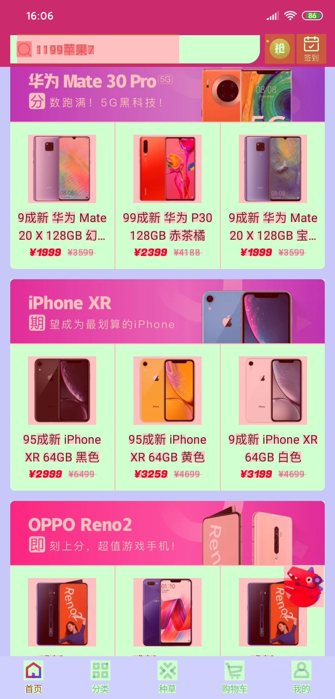

* 首页第三部分UI过度绘制情况
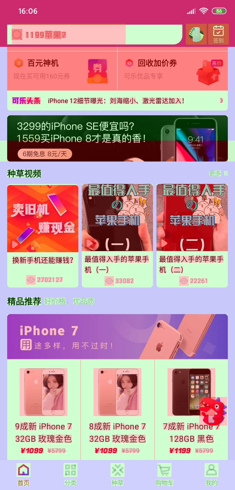

* 首页第四部分UI过度绘制情况
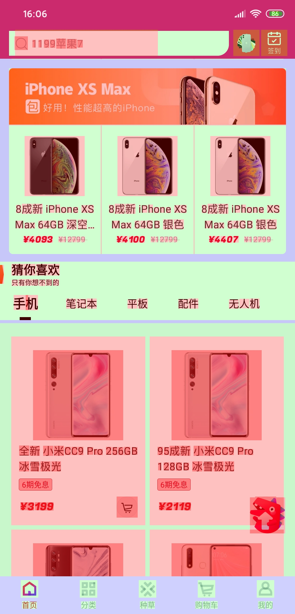

### 过度绘制如何区分

每个颜色的说明如下：

- 原色：没有过度绘制
- 紫色：1 次过度绘制
- 绿色：2 次过度绘制
- 粉色：3 次过度绘制
- 红色：4 次及以上过度绘制

> 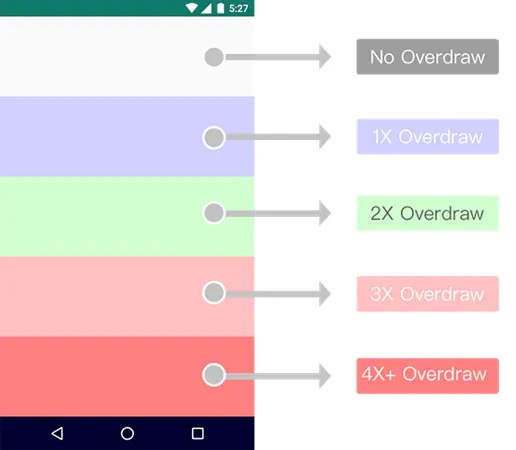

### 如何减少过度绘制
造成过度优化的关键是什么？多余的背景（Background）。

这里我们针对第一部分UI中的**秒杀ITEM部分**进行分析，并给出解决方案。

#### 分析过度绘制的原因
- 主页中item布局所属父布局中第一个设置bg的地方

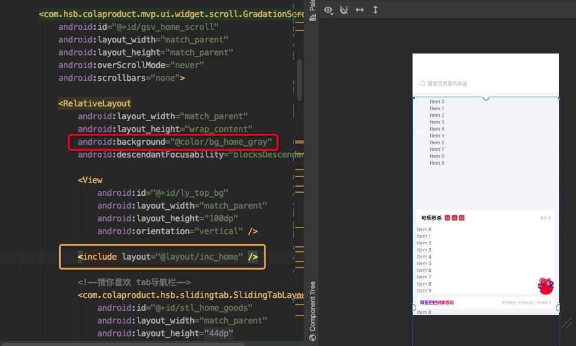
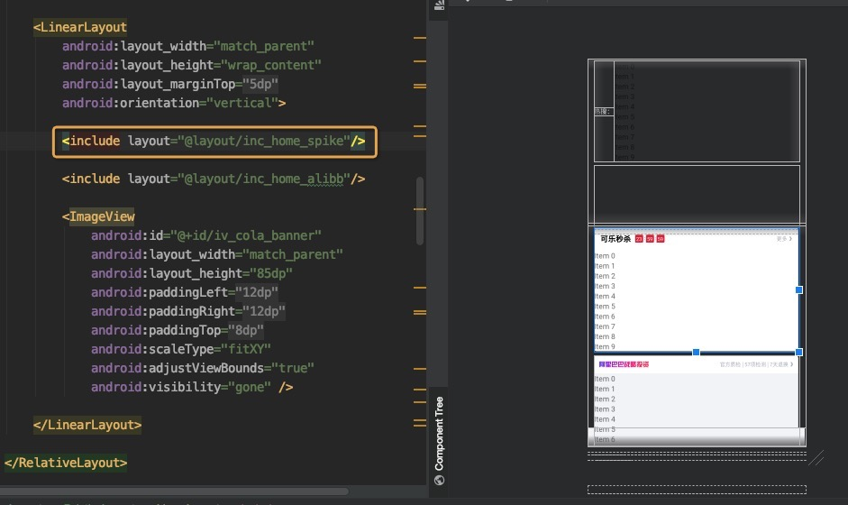
> 红色圈起来的地方，表示设置的bg；黄色圈起来的地方表示item在当前布局中所属层级

- item所属rv
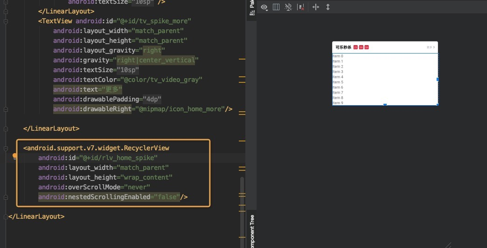

- item布局
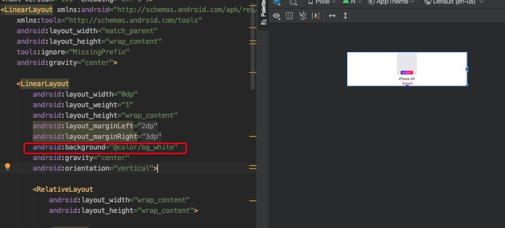

#### 减少bg设置

分析UI和代码，我们发现`item布局`中的背景设是多余的，修改`android标签`为`tools标签`。

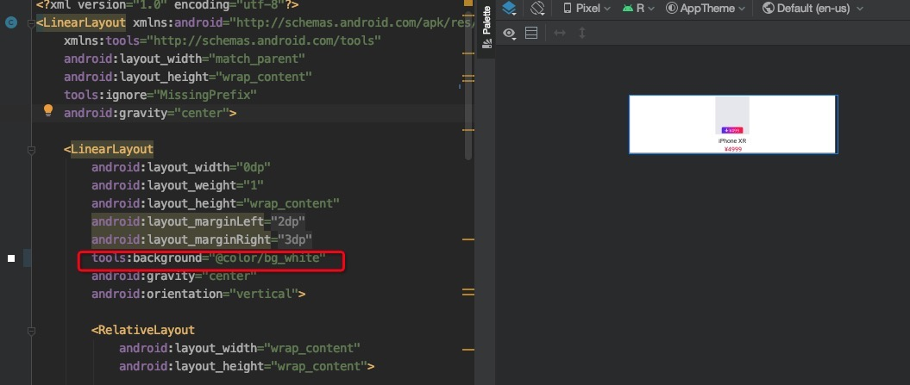

> 修改后的UI过度绘制效果为:


> 除了布局中多余背景，还有可能在代码里添加了多余的背景，这里不进行另外说明。自定义view时，通过Canvas的clipRect方法控制每个视图每次刷新的区域，这样可以避免刷新不必要的区域，从而规避过渡绘制的问题。还可以使用canvas.quickreject()来判断是否和某个矩形相交，从而跳过那些非矩形区域内的绘制操作。

## 布局冗杂

布局太过复杂，层级嵌套太深导致绘制操作耗时，且增加内存的消耗。我们的目标就是，[层级扁平化](https://baike.baidu.com/item/%E6%89%81%E5%B9%B3%E5%8C%96%E5%B1%82%E7%BA%A7%E7%BB%93%E6%9E%84/4014264?fr=aladdin)。

### 如何发现问题

可以通过`GPU呈现模式`分析（大致定位问题）。

> 开发者选项 — GPU呈现模式分析 — 选择“在屏幕上显示为条形图”

这里展示首页的GPU分析图：
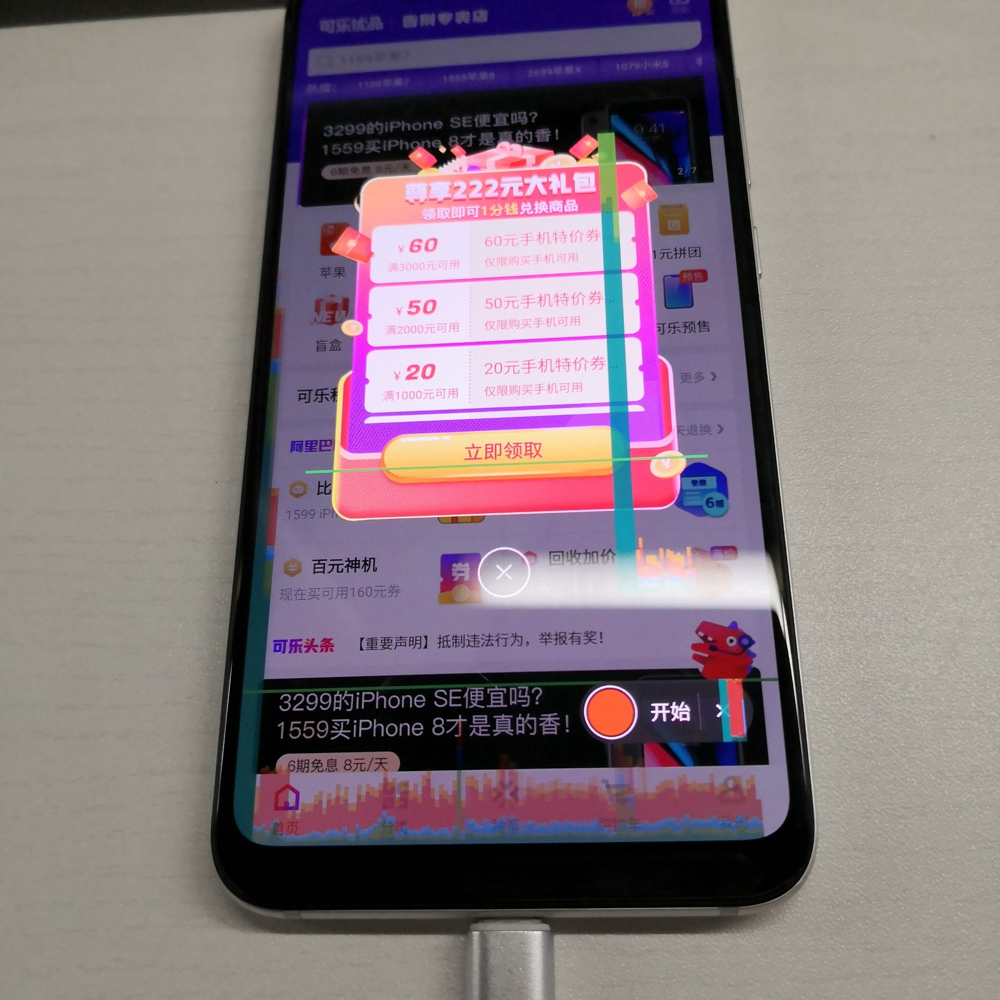

> Android开发者选项——Gpu呈现模式分析，参考[这里](http://www.voidcn.com/blog/gjy211/article/p-6210447.html)。

> 还可以启用严格模式（不止渲染性能）。应用在主线程上执行长时间操作时会闪烁屏幕。通过代码进行严格模式（StrictMode）调试，参考[这里](http://www.tuicool.com/articles/ueeM7b6)。

### 布局层级分析

这里同样以**秒杀ITEM部分**进行分析。

> 等待需要观察的页面加载完成 - 打开 `Hierarchy Viewer `或 `Layout Inspector` - 选择对应需要调试的应用

具体用法参考[这里](https://www.jianshu.com/p/174b105ed7ca)。这里由于是我们自己的项目，直接放出xml布局：

```xml
<?xml version="1.0" encoding="utf-8"?>
<LinearLayout xmlns:android="http://schemas.android.com/apk/res/android"
    xmlns:tools="http://schemas.android.com/tools"
    android:layout_width="match_parent"
    android:layout_height="wrap_content"
    tools:ignore="MissingPrefix"
    android:gravity="center">

    <LinearLayout
        android:layout_width="0dp"
        android:layout_weight="1"
        android:layout_height="wrap_content"
        android:layout_marginLeft="@dimen/margin_2"
        android:layout_marginRight="@dimen/margin_3"
        tools:background="@color/bg_white"
        android:gravity="center"
        android:orientation="vertical">

        <RelativeLayout
            android:layout_width="wrap_content"
            android:layout_height="wrap_content">

            <ImageView
                android:id="@+id/iv_item_spike"
                android:layout_width="wrap_content"
                android:layout_height="78dp"
                android:paddingLeft="@dimen/margin_15"
                android:paddingRight="@dimen/margin_15"
                android:paddingTop="@dimen/margin_3"
                android:src="@drawable/bg_image_src_stace"/>

            <LinearLayout
                android:id="@+id/ly_spike_down_price"
                android:layout_width="wrap_content"
                android:layout_height="wrap_content"
                android:background="@mipmap/ic_home_spike_head"
                android:layout_alignBottom="@+id/iv_item_spike"
                android:layout_centerHorizontal="true"
                android:layout_marginBottom="@dimen/margin_2"
                android:gravity="center"
                android:orientation="horizontal">

                <ImageView
                    android:layout_width="wrap_content"
                    android:layout_height="wrap_content"
                    android:src="@mipmap/ic_spike_down"/>

                <TextView
                    android:id="@+id/tv_spike_down_price"
                    android:layout_width="wrap_content"
                    android:layout_height="wrap_content"
                    android:text="¥499"
                    android:layout_marginLeft="@dimen/margin_2"
                    android:textColor="@color/bg_white"
                    android:textSize="@dimen/text_size_little_2"/>
            </LinearLayout>

        </RelativeLayout>
        <TextView
            android:id="@+id/tv_item_spike_name"
            android:layout_width="wrap_content"
            android:layout_height="wrap_content"
            android:text="iPhone XR"
            android:maxLines="1"
            android:ellipsize="end"
            android:layout_marginTop="@dimen/margin_4"
            android:textColor="@color/mine_text_setting"
            android:textSize="@dimen/text_size_little" />


        <TextView
            android:id="@+id/tv_spike_price"
            android:layout_width="wrap_content"
            android:layout_height="wrap_content"
            android:text="¥4999"
            android:textAllCaps="true"
            android:textColor="@color/guide_red"
            android:paddingLeft="@dimen/margin_3"
            android:textAppearance="@style/TextAppearance.FontPathView"
            android:textSize="@dimen/text_size_little" />

    </LinearLayout>


</LinearLayout>

```
### 布局层级优化指标

第一个建议：可以使用相对布局减少层级的就使用相对布局，否则使用线性布局。Android中RelativeLayout和LinearLayout性能分析，[参考](http://www.jianshu.com/p/8a7d059da746#)。

> 这里我们直接使用`ConstraintLayout`来实现扁平化层级，用法参考[这里](https://lexiangla.com/teams/k100006/docs/cc2d7360808e11ea97430a58ac13dae5?company_from=1f1f37b6dc7c11e7aebd5254005b9a60)。

第二个建议：用merge标签来合并布局，这可以减少布局层次。

第三个建议：用include标签来重用布局，抽取通用的布局可以让布局的逻辑更清晰明了，但要避免include乱用。

第四个建议：避免创建不必要的布局层级。（最容易发生的！）

第五个建议：使用惰性控件ViewStub实现布局动态加载

### 实现扁平化布局

针对**秒杀ITEM部分**，我们直接使用`ConstraintLayout`来实现改效果。最终xml为：
```xml
<?xml version="1.0" encoding="utf-8"?>
<android.support.constraint.ConstraintLayout xmlns:android="http://schemas.android.com/apk/res/android"
    xmlns:app="http://schemas.android.com/apk/res-auto"
    xmlns:tools="http://schemas.android.com/tools"
    android:layout_width="match_parent"
    android:layout_height="wrap_content"
    android:gravity="center"
    tools:background="@color/bg_white"
    tools:ignore="MissingPrefix">

    <ImageView
        android:id="@+id/iv_item_spike"
        android:layout_width="wrap_content"
        android:layout_height="78dp"
        android:paddingLeft="@dimen/margin_15"
        android:paddingTop="@dimen/margin_3"
        android:paddingRight="@dimen/margin_15"
        android:src="@drawable/bg_image_src_stace"
        app:layout_constraintLeft_toLeftOf="parent"
        app:layout_constraintRight_toRightOf="parent"
        app:layout_constraintTop_toTopOf="parent" />

    <LinearLayout
        android:id="@+id/ly_spike_down_price"
        android:layout_width="wrap_content"
        android:layout_height="wrap_content"
        android:layout_centerHorizontal="true"
        android:layout_marginBottom="@dimen/margin_2"
        android:background="@mipmap/ic_home_spike_head"
        android:gravity="center"
        android:orientation="horizontal"
        app:layout_constraintBottom_toBottomOf="@id/iv_item_spike"
        app:layout_constraintLeft_toLeftOf="parent"
        app:layout_constraintRight_toRightOf="parent">

        <ImageView
            android:layout_width="wrap_content"
            android:layout_height="wrap_content"
            android:src="@mipmap/ic_spike_down" />

        <TextView
            android:id="@+id/tv_spike_down_price"
            android:layout_width="wrap_content"
            android:layout_height="wrap_content"
            android:layout_marginLeft="@dimen/margin_2"
            android:text="¥499"
            android:textColor="@color/bg_white"
            android:textSize="@dimen/text_size_little_2" />
    </LinearLayout>

    <TextView
        android:id="@+id/tv_item_spike_name"
        android:layout_width="wrap_content"
        android:layout_height="wrap_content"
        android:layout_marginTop="@dimen/margin_4"
        android:ellipsize="end"
        android:maxLines="1"
        android:text="iPhone XR"
        android:textColor="@color/mine_text_setting"
        android:textSize="@dimen/text_size_little"
        app:layout_constraintLeft_toLeftOf="parent"
        app:layout_constraintRight_toRightOf="parent"
        app:layout_constraintTop_toBottomOf="@id/ly_spike_down_price" />


    <TextView
        android:id="@+id/tv_spike_price"
        android:layout_width="wrap_content"
        android:layout_height="wrap_content"
        android:paddingLeft="@dimen/margin_3"
        android:text="¥4999"
        android:textAllCaps="true"
        android:textAppearance="@style/TextAppearance.FontPathView"
        android:textColor="@color/guide_red"
        android:textSize="@dimen/text_size_little"
        app:layout_constraintLeft_toLeftOf="parent"
        app:layout_constraintRight_toRightOf="parent"
        app:layout_constraintTop_toBottomOf="@id/tv_item_spike_name" />

</android.support.constraint.ConstraintLayout>

```
> 其他优化方案，不再详细描述，具体参考[这里](https://www.jianshu.com/p/307ba8911799)。
