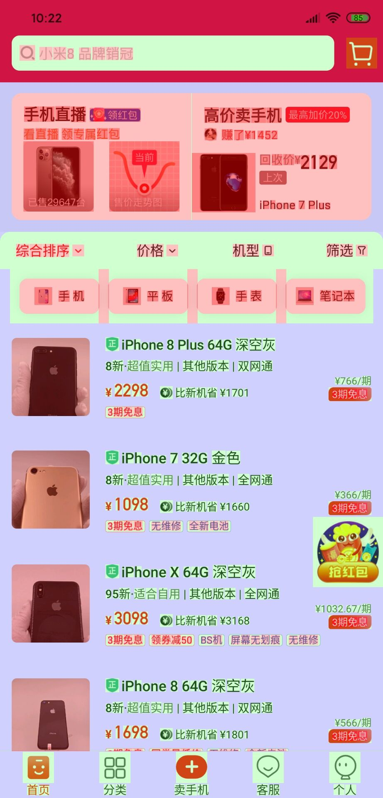
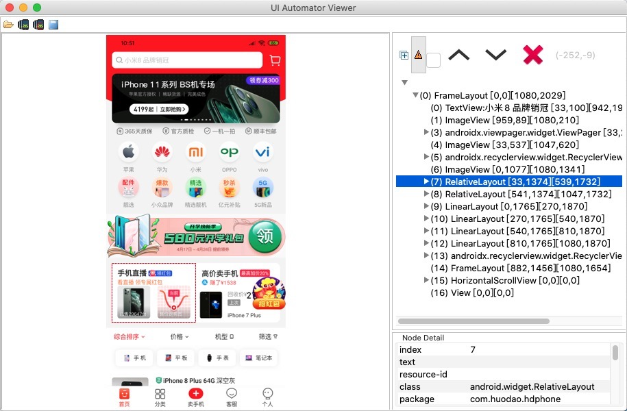

# 找靓机UI渲染数据

这里针对可乐优品的首页分析其中的`过度渲染`和`布局冗杂`问题，但不再提出解决方案。

## 过度渲染
和`可乐优品`的检测页面一样，我们取首页检测数据。

* 首页第一部分UI过度绘制情况

* 首页第二部分UI过度绘制情况

## 布局冗杂

由于我们没有`找靓机`的项目代码，去反编译找寻布局文件比较耗时，这里直接使用SDK的工具`uiautomatorviewer`来获取对应的布局资源文件。

> 找到Android SDK 的文件夹 (xx/studio_sdk/tools/bin)，打开`uiautomatorviewer`，选择对应的手机，即可查看布局信息。

我们获取对应**手机直播ITEM**处的布局：

